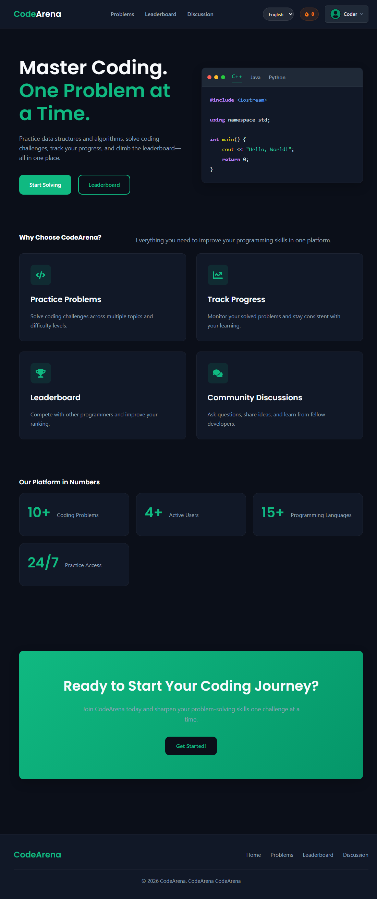
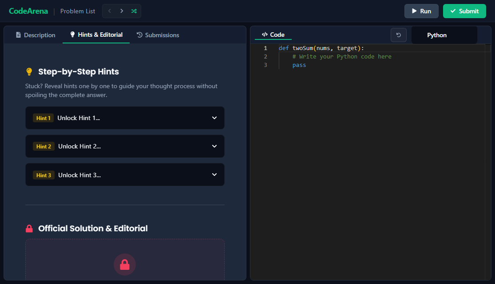
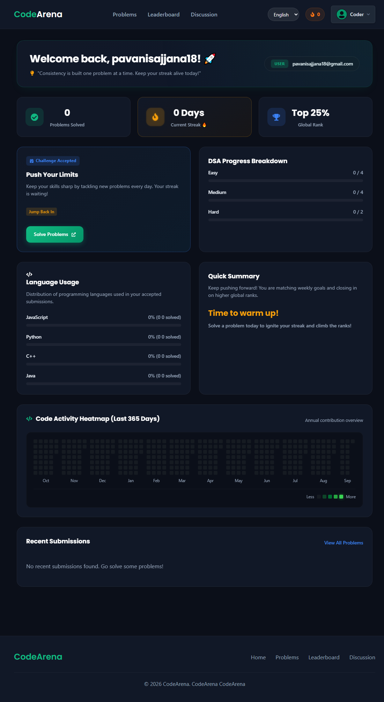
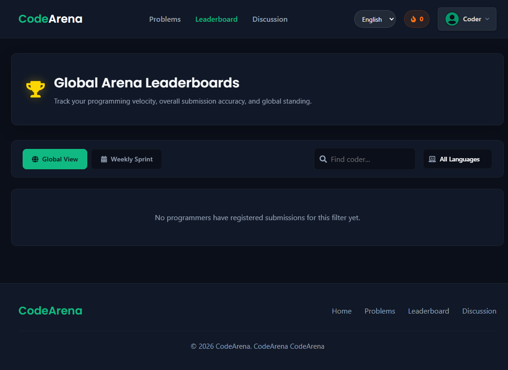
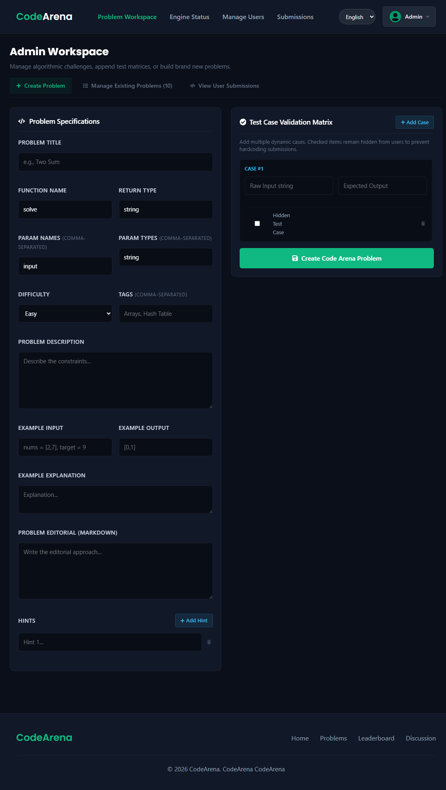

# ⚔️ CodeArena

> **A full-stack coding practice and performance assessment platform** built as part of the **Infosys Springboard Virtual Internship 7.0**.

<p align="center">
  
  
  
  
  
</p>

---

## 🚀 About

**CodeArena** is a full-stack coding platform designed to provide an interactive environment for practicing programming, submitting solutions, evaluating code, tracking progress, and competing through leaderboards.

Users can:

* 🔎 Browse and filter programming problems
* 💻 Write and execute code using a Monaco-based editor
* 🧪 Submit solutions and receive verdicts
* 📈 Track submissions and coding progress
* 🏆 View leaderboards and rankings
* 💡 Use hints and editorials
* 💬 Participate in coding discussions

The platform also provides a dedicated **Admin Panel** for managing problems, test cases, users, submissions, analytics, hints, and editorials.

---

## ✨ Key Features

| Feature                   | Description                                                    |
| :------------------------ | :------------------------------------------------------------- |
| 🔐 **Authentication**     | JWT-based authentication with role-based access                |
| 🧩 **Problem Bank**       | Problems with difficulty, topics, starter code, and test cases |
| 💻 **Monaco Editor**      | IDE-like coding experience                                     |
| ⚙️ **Code Execution**     | Containerized execution with language-specific limits          |
| 🧪 **Online Judge**       | Test-case evaluation with verdicts and execution results       |
| 🏆 **Leaderboard**        | Global, weekly, and language-based rankings                    |
| 📊 **Dashboard**          | Progress, activity heatmap, language usage, and submissions    |
| 💡 **Hints & Editorials** | Guided assistance and detailed solutions                       |
| 💬 **Discussions**        | Community discussions around coding problems                   |
| 🛠️ **Admin Panel**       | Problem, user, submission, and platform management             |
| 📧 **Email Services**      | Welcome emails and password reset support                  |

---

## 💻 Supported Languages

| Language      | Support |
| :------------ | :-----: |
| ☕ Java        |    ✅    |
| 🐍 Python     |    ✅    |
| ⚡ C++         |    ✅    |
| 🟨 JavaScript |    ✅    |

---

## 📸 Screenshots

### 🏠 Home



### 💻 Problem & Monaco Editor



### 📊 Dashboard & Leaderboard

|                   Dashboard                  |                    Leaderboard                   |
| :------------------------------------------: | :----------------------------------------------: |
|  |  |

### 🛠️ Admin Panel



---

## 🏗️ Architecture

```text
                 ┌──────────────────────┐
                 │      React.js        │
                 │   Frontend / UI      │
                 └──────────┬───────────┘
                            │ REST APIs
                            ▼
                 ┌──────────────────────┐
                 │     Spring Boot      │
                 │ Controllers/Services │
                 │ Spring Security + JWT│
                 └──────────┬───────────┘
                            │
             ┌──────────────┼──────────────┐
             ▼              ▼              ▼
        PostgreSQL      Online Judge    Flyway/JPA
                            │
                            ▼
                         Docker
                    Isolated Execution
```

## 🔄 Submission Flow

```text
                    Problem Selection
                           ↓
                Code written in Monaco Editor
                           ↓
                         Submit
                           ↓
                    Spring Boot API
                           ↓
                  Docker-based Execution
                           ↓
                    Test Case Evaluation
                           ↓
                 Verdict + Execution Details
                           ↓
              Submission / Dashboard / Leaderboard
```

---

## 🛠️ Tech Stack

### 🎨 Frontend

* React.js
* Vite
* Monaco Editor
* React Router
* CSS

### ⚙️ Backend

* Java 17
* Spring Boot
* Spring Security
* JWT
* Spring Data JPA
* Flyway

### 🗄️ Database

* PostgreSQL
* H2 for local development/testing

### 🐳 Execution

* Docker
* Language-specific execution environments

---

## ▶️ Local Setup

### 1. Backend

```bash
cd backend
./mvnw spring-boot:run
```

**On Windows:**

```powershell
cd backend
.\mvnw.cmd spring-boot:run
```

### 2. Frontend

```bash
cd frontend
npm install --legacy-peer-deps
npm run dev
```

The frontend runs on the Vite development server and communicates with the Spring Boot backend.

> **Note:** Docker is required for the code-execution/judge functionality. The application itself can be started locally without Docker, but actual code execution depends on the Docker-based judge environment.

---

## 🧪 Testing

Backend tests are implemented using **JUnit 5**.

Frontend includes **Cypress** end-to-end testing support.

### Production Frontend Build

```bash
cd frontend
npm run build
```

---

## 🔐 Security

- 🔑 JWT-based authentication
- 🛡️ Role-based authorization
- 👑 Admin-only management operations
- 🔄 Password reset functionality
- 🔗 Google authentication
- 📦 Isolated code execution through Docker
- ⏱️ Resource and timeout controls for submitted programs
- 🔒 Environment-based configuration for sensitive credentials

Sensitive credentials are configured through environment variables rather than being stored in the current application configuration.

---

## 👥 Team

### Infosys Springboard Virtual Internship 7.0 — Team 5

Built collaboratively as a full-stack coding practice and assessment platform.

---

<p align="center">

**⚔️ CodeArena — Code. Practice. Compete.**

*Built as part of the Infosys Springboard Virtual Internship 7.0.*

</p>
