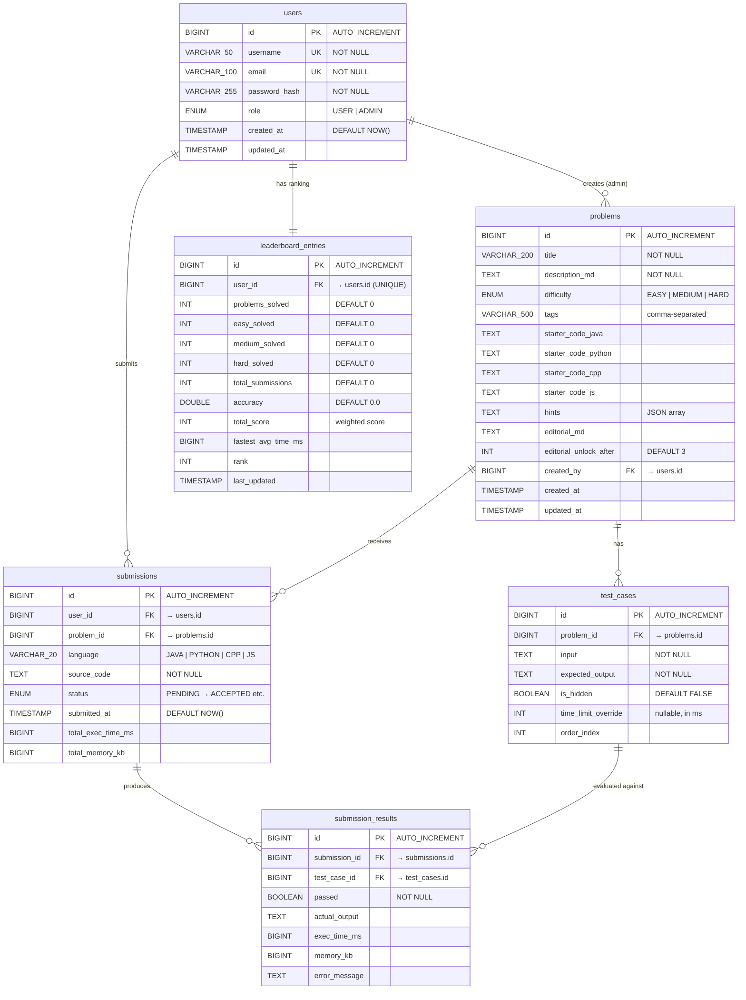

# CodeArena — Entity-Relationship Diagram

## ER Diagram

## Enum Types

| Enum Name | Values | Used In |
|-----------|--------|---------|
| `user_role` | `USER`, `ADMIN` | `users.role` |
| `difficulty_level` | `EASY`, `MEDIUM`, `HARD` | `problems.difficulty` |
| `submission_status` | `PENDING`, `RUNNING`, `ACCEPTED`, `WRONG_ANSWER`, `TIME_LIMIT_EXCEEDED`, `MEMORY_LIMIT_EXCEEDED`, `RUNTIME_ERROR`, `COMPILATION_ERROR` | `submissions.status` |
| `language` | `JAVA`, `PYTHON`, `CPP`, `JAVASCRIPT` | `submissions.language` |

## Relationship Summary

| Relationship | Type | Constraint |
|-------------|------|------------|
| `users` → `problems` | One-to-Many | `problems.created_by` FK → `users.id` |
| `users` → `submissions` | One-to-Many | `submissions.user_id` FK → `users.id` |
| `users` → `leaderboard_entries` | One-to-One | `leaderboard_entries.user_id` FK → `users.id` (UNIQUE) |
| `problems` → `test_cases` | One-to-Many | `test_cases.problem_id` FK → `problems.id` (CASCADE DELETE) |
| `problems` → `submissions` | One-to-Many | `submissions.problem_id` FK → `problems.id` |
| `submissions` → `submission_results` | One-to-Many | `submission_results.submission_id` FK → `submissions.id` (CASCADE DELETE) |
| `test_cases` → `submission_results` | One-to-Many | `submission_results.test_case_id` FK → `test_cases.id` |
